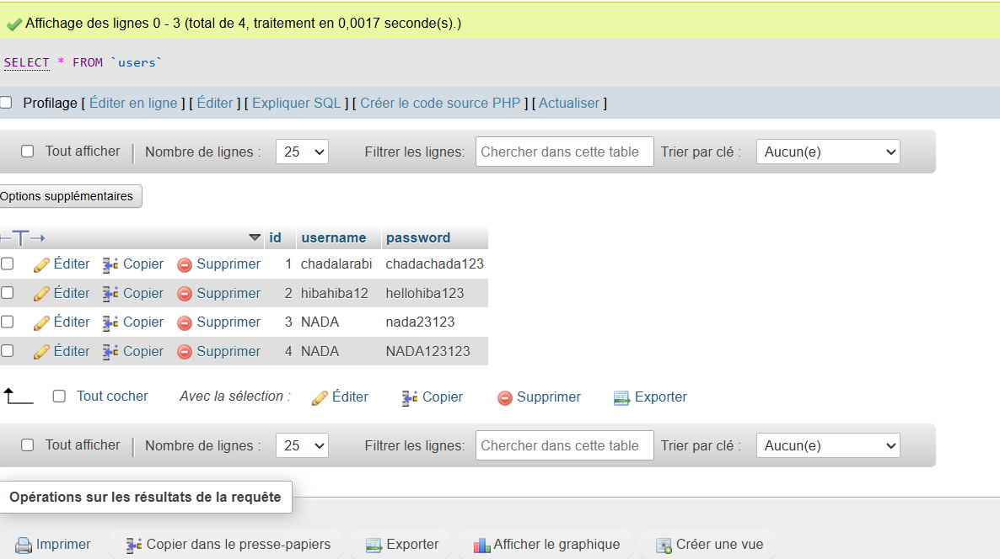
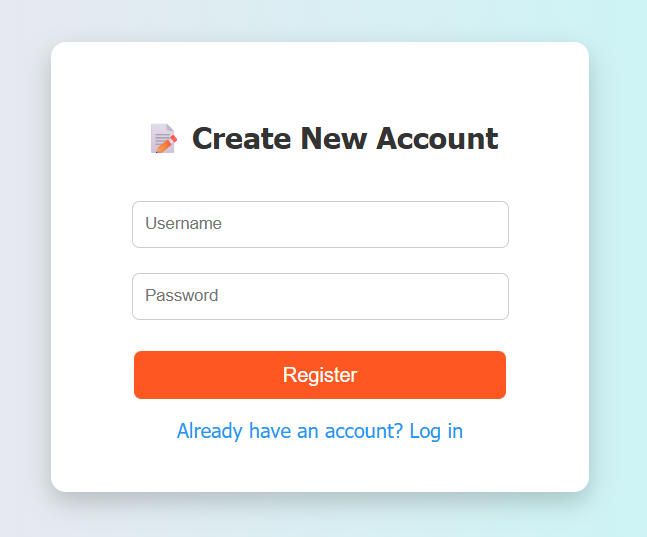

# 🔐 Login & Registration System (Flask + MySQL)

A simple **Login and Registration web application** built with **Python (Flask)**, **MySQL**, and **HTML/CSS**.  
This project demonstrates basic authentication functionality for learning and showcasing purposes.

---

## 💡 Project Idea
The goal of this project is to create a simple and functional **user authentication system**, where users can:
- Create a new account  
- Log in using their credentials  
- Get an error message if credentials are incorrect  
- Receive a welcome message when login is successful  

---

## 🛠️ Technologies Used
- **Python** 🐍  
- **Flask Framework** 🌐  
- **MySQL Database** 🗄️  
- **HTML / CSS** 🎨  

---

## 📸 Project Screenshots

### 1️⃣ MySQL Database
User table showing all registered users.


---

### 2️⃣ Login Page
User enters username and password.


---

### 3️⃣ Incorrect Credentials
If the username or password is incorrect, an error message appears:
**"Incorrect username or password"**


---

### 4️⃣ Registration Page
Users can create a new account here.


---

### 5️⃣ Successful Login
If credentials are correct, a welcome message is displayed:
**"Welcome [username]"**


---

## ⚙️ How to Run the Project

1. **Install required packages:**
   ```bash
   pip install flask mysql-connector-python
Run the Flask application:

bash
Copier le code
python app.py
Open your browser and visit:

cpp
Copier le code
http://127.0.0.1:5000/
👩‍💻 Developer
Chada Larabi
This project was created as part of a learning and training demonstration using Flask and MySQL.

yaml
Copier le code
